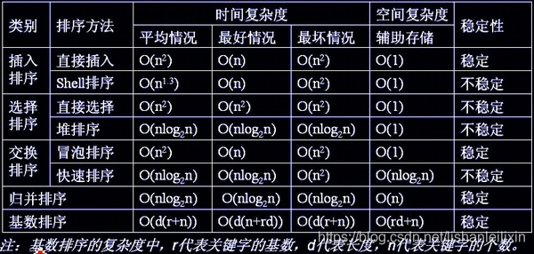

# 排序总结

### 插入排序
- 直接插入排序
- 折半插入排序
- 希尔排序

### 交换排序
- 冒泡排序
- 快速排序

### 选择排序
- 简单选择排序
- 堆排序

### 归并排序
- 参考：[归并排序的理解和实现](https://blog.csdn.net/lishanleilixin/article/details/88603811?ops_request_misc=%257B%2522request%255Fid%2522%253A%2522162849823216780274119644%2522%252C%2522scm%2522%253A%252220140713.130102334.pc%255Fblog.%2522%257D&request_id=162849823216780274119644&biz_id=0&utm_medium=distribute.pc_search_result.none-task-blog-2~blog~first_rank_v2~rank_v29-2-88603811.pc_v2_rank_blog_default&utm_term=%E5%BD%92%E5%B9%B6%E6%8E%92%E5%BA%8F&spm=1018.2226.3001.4450)

### 非比较类排序
- 桶排序
- 基数排序
- 计数排序